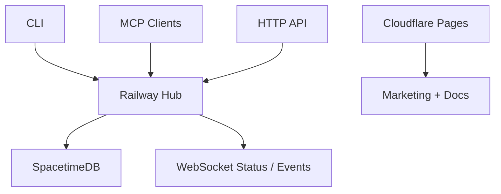

# Heiwa

[](https://railway.app)
[](https://spacetimedb.com)
[](https://cloudflare.com)
[](https://developer.mozilla.org/en-US/docs/Web/API/WebSockets_API)

Heiwa is the canonical repo for the Heiwa control plane. The supported first-class surfaces are:

- CLI
- MCP
- HTTP API
- Docs

The current consolidation target is a fast stack built around SpacetimeDB state, Railway runtime, Cloudflare marketing/docs surfaces, and WebSocket-first live status/event transport.

Cold-start operators and agents should begin with `HEIWA.md`.

## Current State

Heiwa is under active runtime hardening against the March 6, 2026 blueprint. This repo should not describe placeholder agents, Discord flows, or legacy compatibility layers as stack-complete.

What is in scope now:

- Railway-hosted hub runtime
- SpacetimeDB as the state layer
- WebSocket-first public status/event transport
- Heiwa CLI and MCP as operator surfaces
- Cloudflare-hosted marketing and documentation pages

What is not treated as stack-complete:

- Discord as a required ingress surface
- legacy `heiwa-limited` as an active target or source repo
- placeholder Codex/OpenClaw personas presented as product capabilities

## Runtime Topology



- `apps/heiwa_hub`: Railway runtime, MCP/HTTP API surface, health/status endpoints
- `apps/heiwa_cli`: operator CLI and local execution wrappers
- `packages/heiwa_sdk`: state, security, gateway, and platform helpers
- `packages/heiwa_bindings`: generated Rust/TypeScript SpacetimeDB clients plus the Python bridge slot
- `packages/heiwa_protocol`: shared contracts and schemas
- `docs/`: MkDocs Material documentation source
- `apps/heiwa_web`: Cloudflare Pages marketing/status shell

## Quick Start

```bash
cd ~/heiwa
source .venv/bin/activate
export PYTHONPATH="$(pwd)/packages/heiwa_sdk:$(pwd)/packages/heiwa_protocol:$(pwd)/packages/heiwa_identity:$(pwd)/packages/heiwa_ui:$(pwd)/apps"
python -m apps.heiwa_hub.main
./apps/heiwa_cli/heiwa cells
./apps/heiwa_cli/heiwa bench
```

## Verification

```bash
python apps/heiwa_hub/tests/test_intent_classifier.py
python apps/heiwa_hub/tests/test_risk_scorer.py
python apps/heiwa_hub/tests/test_compute_router.py
python apps/heiwa_hub/tests/test_agent_context_map.py
python apps/heiwa_hub/tests/test_heiwa_cells_catalog.py
python apps/heiwa_hub/tests/test_heiwa_bench.py
python apps/heiwa_hub/tests/test_stdb_native_state.py
./apps/heiwa_hub/scripts/generate_spacetimedb_bindings.sh
python -m pip install -r docs/requirements.txt
mkdocs build --strict
python apps/heiwa_web/scripts/check_static_surface.py
```

## Docs

- Source: [`docs/`](docs/)
- MkDocs config: [`mkdocs.yml`](mkdocs.yml)
- Public docs target: `docs.heiwa.ltd`

## Key Manifests

- [`config/swarm/BUILD_BLUEPRINT_2026-03-06.md`](config/swarm/BUILD_BLUEPRINT_2026-03-06.md)
- [`config/swarm/ai_router.json`](config/swarm/ai_router.json)
- [`config/identities/profiles.json`](config/identities/profiles.json)
- [`config/swarm/domain_plan.md`](config/swarm/domain_plan.md)
- [`HEIWA.md`](HEIWA.md)
