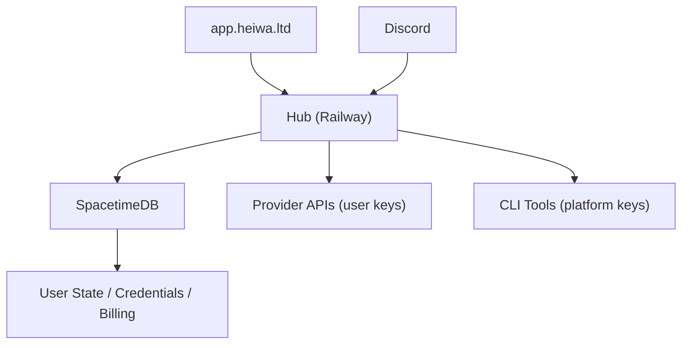

# Heiwa

[](https://railway.app)
[](https://spacetimedb.com)
[](https://app.heiwa.ltd)
[](https://discord.com)

Heiwa is a BYOK (Bring Your Own Keys) agent orchestration platform. Connect your own AI provider API keys and OAuth credentials. Heiwa wraps every inference provider, scores intent and risk, and routes each task to the optimal model and provider -- across multi-step agent workflows.

Access via [app.heiwa.ltd](https://app.heiwa.ltd) (web dashboard) and Discord DMs.

## What Heiwa Does

Users bring their own API keys (OpenAI, Anthropic, Google, etc.). Heiwa handles the rest:

- **Intent classification** -- understands what you want to do
- **Risk scoring** -- evaluates safety and cost implications
- **Optimal routing** -- picks the best model/provider for each step, using your keys and rate limits
- **Multi-step orchestration** -- chains tasks into agent workflows with structured execution programs
- **Multi-tenant state** -- every user's credentials, runs, and results are scoped and isolated

No vendor lock-in. No platform inference costs passed to you. Your keys, your budget, Heiwa's routing intelligence.

## Architecture

| Component | Location | Role |
|-----------|----------|------|
| **Hub** | `apps/heiwa_hub/` | Railway-hosted runtime -- cognition pipeline, agent execution, API surface |
| **SpacetimeDB** | `apps/heiwa_hub/spacetimedb/` | Multi-tenant state engine -- users, credentials, proposals, runs, billing |
| **Web** | `apps/heiwa_web/` | `app.heiwa.ltd` -- dashboard, key management, mission history |
| **Discord** | `apps/heiwa_hub/agents/` | Alternative interface -- DM-based task submission and results |
| **SDK** | `packages/heiwa_sdk/` | State, security, gateway, routing, scheduler |
| **Cognition** | `packages/heiwa_cognition/` | Intent normalizer, risk scorer, compute router, program compiler |
| **Protocol** | `packages/heiwa_protocol/` | Shared typed contracts and schemas |
| **Bindings** | `packages/heiwa_bindings/` | Generated SpacetimeDB clients (Rust/TypeScript/Python) |

## Runtime Topology



## Verticals

**Trading** -- Polymarket analysis and paper-trading. Heiwa runs market scans using your inference budget, scores opportunities, and surfaces results via Discord DM and web dashboard. Source: `apps/heiwa_trading/`.

**Autoresearch** -- Karpathy-style autonomous research loops. Define a research question, Heiwa orchestrates multi-model deep dives and delivers structured findings.

## Quick Start

```bash
cd ~/heiwa
source .venv/bin/activate
export PYTHONPATH="$(pwd)/packages/heiwa_sdk:$(pwd)/packages/heiwa_protocol:$(pwd)/packages/heiwa_identity:$(pwd)/packages/heiwa_ui:$(pwd)/apps"
python -m apps.heiwa_hub.main
./apps/heiwa_cli/heiwa cells
./apps/heiwa_cli/heiwa bench
```

## Product Graph

The root [`justfile`](justfile) is the product build contract. If a task is not represented there, it is not part of the hosted product graph.

- Product surfaces: `apps/`, `packages/`, `config/`, `infra/`, `docs/`, `scripts/`
- Operator-only context/tooling: `ops/`

## Key Manifests

- [`config/swarm/BUILD_BLUEPRINT_2026-03-06.md`](config/swarm/BUILD_BLUEPRINT_2026-03-06.md)
- [`config/swarm/ai_router.json`](config/swarm/ai_router.json)
- [`config/identities/profiles.json`](config/identities/profiles.json)
- [`config/swarm/domain_plan.md`](config/swarm/domain_plan.md)
- [`HEIWA.md`](HEIWA.md)
