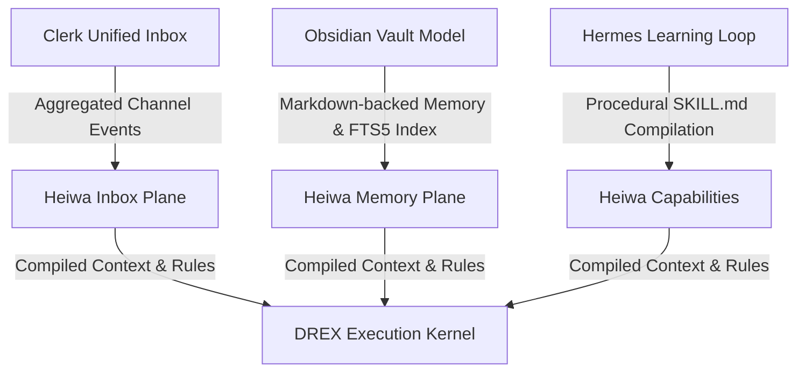

# Heiwa: The Unified Inference & Machine Resource Execution Fabric (2026-05)

This document establishes the strategic direction and high-ROI technical blueprint to make **Heiwa** the most versatile, resource-compiled agent-orchestration and execution fabric. It synthesizes architectural lessons mined from **Hermes Agent**, **Obsidian**, and **Clerk AI** with concrete models for compiling multi-tier inference (GPU vs. Cloud) and machine resources (CPU/RAM/Disk).

---

## 1. Competitive Architecture Mining & Synthesis

By analyzing the source designs of leading peer products, we identify three critical paradigms that can be integrated into Heiwa's core architecture to maximize local-first effectiveness:



### A. Clerk AI: The Unified Channel Inbox

- **The Pattern**: Clerk treats voice, RCS, SMS, WhatsApp, and web-chat as a single unified channel workspace. Memory, context, and warm transfers are handled by one core event pipeline rather than separate product silos.
- **Heiwa Implication**: Heiwa's intake plane must model all interaction channels (CLI prompts, HTTP webhooks, Discord socket events, Unix socket streams) as a single typed `InboxItem` stream. All interactions are recorded into local SQLite databases under `/Users/dmcgregsauce/.heiwa/state/evidence/inbox.db`, ensuring that multi-agent session recall is perfectly aligned across all interfaces.

### B. NousResearch/hermes-agent: Self-Improving Skills & Persistent Terminal

- **The Pattern**: Hermes maintains long-lived, persistent execution state (e.g. continuous bash terminals) and employs a "closed learning loop." The agent reviews successful task runs, compresses the exact procedural steps into Markdown-based "Skills," and registers them to a pluggable vector index for future task execution.
- **Heiwa Implication**: We should treat local developer skills as standard Markdown files under `~/.heiwa/skills/` (matching the Obsidian vault structure). When Heiwa completes a complex sequence (e.g., a multi-step release verification), the DREX kernel should compress the trajectory into a `SKILL.md` template containing deterministic bash scripts and prompt triggers. Future routing queries then perform SQLite FTS5 (Full-Text Search) and vector lookups across these files to match intent.

### C. Obsidian: Local Plain-Text Database & JSON-Canvas

- **The Pattern**: Obsidian acts as a blistering-fast local-first database by storing all notes in open, interoperable Markdown (`.md`) format, while managing complex graphical connections and multi-step canvases using a lightweight, open-standard JSON schema (`.canvas`). A background thread manages an eventually-consistent IndexedDB index for search and backlink performance.
- **Heiwa Implication**: All long-term memories (`MEMORY.md`, `USER.md`) must live as standard Markdown documents in the owner's vault. Complex workflows, tool schemas, and multi-step plan trees should be stored as highly portable JSON logs. This ensures zero vendor lock-in, complete developer readability, and lightning-fast local indexing via background SQLite FTS5 databases.

---

## 2. High-ROI Resource Compilation Path

To make Heiwa highly efficient, it must act as a compile target that orchestrates both **Inference Resources** (quantized local GPUs vs. metered cloud APIs) and **Machine Resources** (local CPU, RAM, and Disk) to maximize input/output efficiency.

```
                +----------------------------------------------+
                |            DREX Routing Decision             |
                +----------------------------------------------+
                                       |
              +------------------------+------------------------+
              |                                                 |
              v                                                 v
+---------------------------+                     +---------------------------+
|  Inference Compiler Plane |                     |  Machine Resource Plane   |
|  - Ollama VRAM/RAM budgets|                     |  - Pipelined Tool execution|
|  - Cloud Prompt Caching   |                     |  - Thread-level isolation |
|  - Cost/Latency checks    |                     |  - Local FTS5 / Vector DB |
+---------------------------+                     +---------------------------+
```

### A. The Inference Compiler Plane (GPU vs. Cloud/Provider)

#### 1. VRAM/RAM-Aware Local Offloading

- **Strategy**: Quantized local models (e.g. Qwen 3.5 9B, Gemma 4) run free and privately via Ollama on Devon's MacBook. The DREX router must track the active VRAM and RAM footprint.
- **Implementation**: If local system memory is heavily saturated by compilation tasks or large Docker builds, DREX dynamically downgrades local inference to highly quantized local models or offloads cognitive tasks to low-cost cloud metered APIs (e.g., Gemini Flash or Claude Haiku). If local memory is clear, it defaults to free local execution to maintain absolute sovereignty.

#### 2. Prompt Cache Optimization

- **Strategy**: Provider models (Anthropic, Gemini) support prompt caching, which reduces API pricing by up to 90% and time-to-first-token (TTFT) by up to 80% for large contexts.
- **Implementation**: The router must strictly segment prompts into:
  1. **Static Prefix** (System instructions, core capability schemas, global routing rules) -> _Cached permanently_.
  2. **Semi-Static Vault** (Local workspace file list, index metadata, git-status) -> _Cached with 5-minute invalidation_.
  3. **Dynamic Intent** (Immediate user prompt, fresh terminal output) -> _Appended at the end_.
     This structure prevents cache-busting dynamic updates from ruining the static prefix, delivering massive speed and cost advantages.

---

### B. The Machine Compute Plane (CPU/RAM/Disk)

#### 1. Multi-Threaded Pipelined Tool Execution

- **Strategy**: Standard single-threaded runtimes lock during tool execution, causing CPU bottlenecks or executor starvation.
- **Implementation**: As successfully demonstrated in `approval_gate.rs`, high-risk or blocking operations (such as waiting for file polls, shell commands, or network transfers) must run in isolated native threads spawned by `std::thread::spawn`. This allows the main asynchronous loop to remain lightweight and fully responsive, driving high execution throughput.

#### 2. Local-First Vector & Text Indexing

- **Strategy**: Sending codebases or files to external vector hosting creates privacy leaks and is highly inefficient.
- **Implementation**: Implement a background file watcher in Rust that compiles a local search index under `~/.heiwa/state/index/`. It generates SQLite FTS5 tables and uses local fast embedding models (e.g. `qwen3-embedding` via Ollama) to store semantic embeddings in a lightweight local SQLite database. This gives the agent instantaneous workspace recall with 100% private execution.

---

## 3. High-ROI Concrete Implementation Blueprint

To deliver these capabilities systematically, we outline a highly focused, step-by-step roadmap:

### Phase 1: Intake & Evidence Consolidation (Short-Term)

- **Goal**: Merge multi-channel events and profile states into a single unified schema.
- **Steps**:
  1. Add `/api/v1/inbox` schema endpoints inside `apps/heiwa_shell/src/cmd/app.rs` that read both local CLI events and remote channel actions (Discord socket triggers) into one structured vector.
  2. Record token counts, CPU run times, and VRAM footprints inside every `ToolCallReceipt` to build an exact execution-cost ledger.

### Phase 2: Procedural Skill Learning (Medium-Term)

- **Goal**: Enable the agent to compile its own skills.
- **Steps**:
  1. Design a standard `~/.heiwa/skills/` folder format where each custom skill is represented by an Obsidian-style Markdown file (`SKILL.md`) with explicit YAML frontmatter specifying:
     - `trigger_intent`: Glob or regex of user prompt intents.
     - `required_leases`: Capabilities that must be granted (e.g. `fs_write`, `net_request`).
     - `procedure`: Bash scripts or agentic instruction chains.
  2. Build a local FTS5 indexing pipeline that parses these skills at shell launch.

### Phase 3: Tauri 2.x GUI & VRAM Monitor (Long-Term)

- **Goal**: Wrap this compiled resource plane in a native macOS UI.
- **Steps**:
  1. Scaffold `apps/heiwa_app/clients/macos` using **Tauri 2.x** with system WKWebView.
  2. Expose Rust native telemetry commands that poll macOS CPU/RAM usage and GPU/VRAM allocation.
  3. Render this resource monitor in the cockpit's status footer so the operator has absolute visibility into exactly how their local and cloud resources are compiled for AI input/output.
